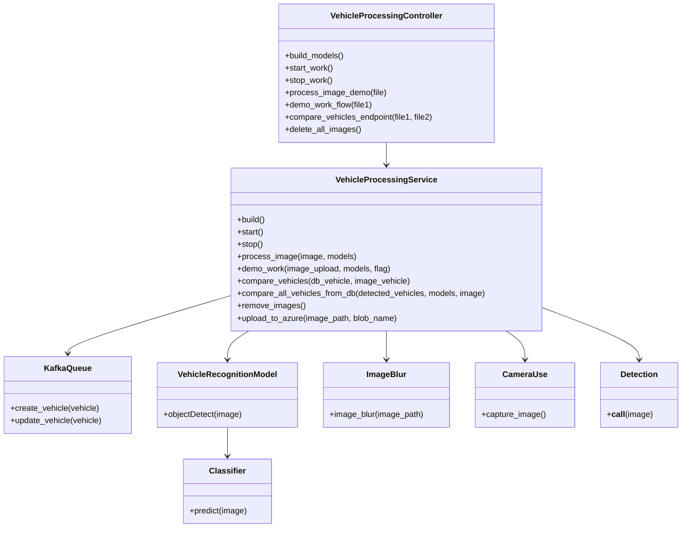

```mermaid
classDiagram

    %% Controllers
    class VehicleProcessingController {
        +build_models()
        +start_work()
        +stop_work()
        +process_image_demo(file)
        +demo_work_flow(file1)
        +compare_vehicles_endpoint(file1, file2)
        +delete_all_images()
    }

    %% Services
    class VehicleProcessingService {
        +build()
        +start()
        +stop()
        +process_image(image, models)
        +demo_work(image_upload, models, flag)
        +compare_vehicles(db_vehicle, image_vehicle)
        +compare_all_vehicles_from_db(detected_vehicles, models, image)
        +remove_images()
        +upload_to_azure(image_path, blob_name)
    }

    class KafkaQueue {
        +create_vehicle(vehicle)
        +update_vehicle(vehicle)
    }

    %% Models
    class VehicleRecognitionModel {
        +objectDetect(image)
    }

    class Classifier {
        +predict(image)
    }

    class ImageBlur {
        +image_blur(image_path)
    }

    class CameraUse {
        +capture_image()
    }

    class Detection {
        +__call__(image)
    }

    %% Dependencies and Relationships
    VehicleProcessingController --> VehicleProcessingService
    VehicleProcessingService --> VehicleRecognitionModel
    VehicleProcessingService --> ImageBlur
    VehicleProcessingService --> CameraUse
    VehicleProcessingService --> Detection
    VehicleProcessingService --> KafkaQueue
    VehicleRecognitionModel --> Classifier

```
